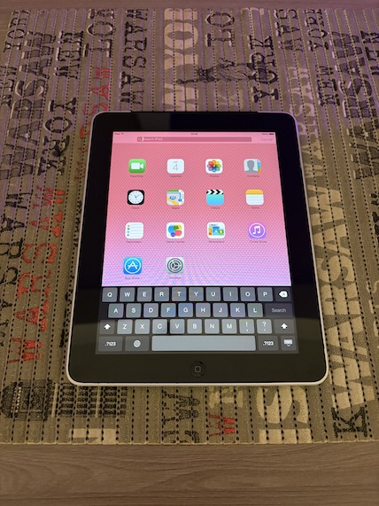
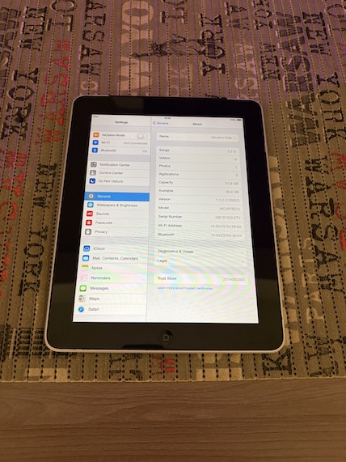

# iOS 7.1.2 for iPad 1

Rewritten version of [ios7resources-ipad1](https://github.com/pwnerblu/ios7resources-ipad1) with enhancements.

Requires macOS (tested with 12 - 14), Xcode or command line tools, internet to fetch dependencies, and root access to preserve perms while patching iOS filesystem. Jailbreak and hactivation are optionally supported. Use `run.tool` to download files, assemble IPSW and restore.

## credits

- [Nicole and Amy](https://github.com/amy-and-nicole): fixes for keyboard, audio, bluetooth, charging, control center, springboard crash, etc.
- [pwnerblu](https://github.com/pwnerblu): [original iOS 7 repo](https://github.com/pwnerblu/ios7resources-ipad1), [device tree diff file](https://github.com/pwnerblu/ios7resources-ipad1/blob/main/dtre/hoodoo_innsbruck.diff), multitouch firmware paths, wifi firmware paths, etc.
- [NyanSatan](https://github.com/NyanSatan): [original iOS 6 repo](https://github.com/NyanSatan/SundanceInH2A), [device tree diff tool](https://github.com/NyanSatan/SundanceInH2A/blob/master/dt/ddt.py), [dsc signature tool](https://github.com/NyanSatan/SundanceInH2A/blob/master/yolosign.py), [untether and runtime device tree fixups](https://github.com/NyanSatan/SundanceInH2A/blob/master/exploit), bluetooth firmware, [iOS 6 writeup](https://nyansatan.github.io/run-unsupported-ios/), etc.
- [staturnzz](https://github.com/staturnzz): bootstrap and aquila untether from [lyncis jailbreak](https://github.com/staturnzz/lyncis)
- [LukeZGD](https://github.com/LukeZGD): many tools from [Legacy-iOS-Kit](https://github.com/LukeZGD/Legacy-iOS-Kit)
- [phoenix3200](https://github.com/phoenix3200): [decache](https://github.com/phoenix3200/decache), basis for graphics driver extractor
- Apple: [dyld](https://github.com/apple-oss-distributions/dyld), all iOS components, etc.

## photos

 
